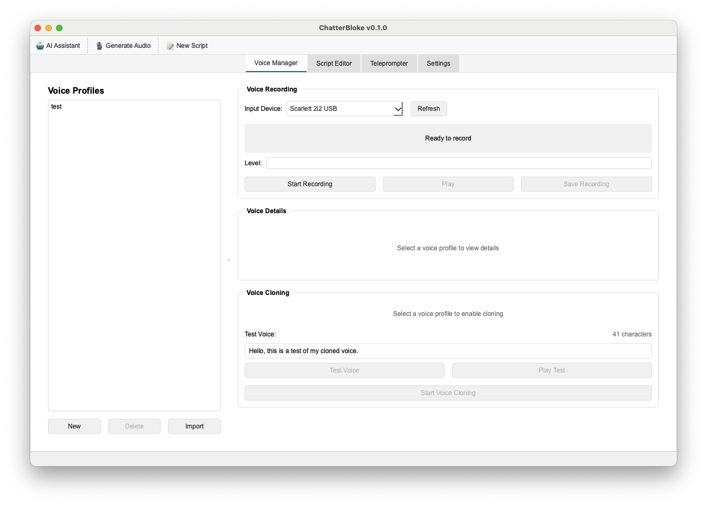

# ChatterBloke 🎙️

**Clone your voice, craft your scripts, and bring your words to life with AI-powered text-to-speech.**



## Overview

ChatterBloke is a comprehensive voice cloning and text-to-speech application that combines the power of AI voice synthesis with an intuitive script management system. Whether you're creating audiobooks, podcasts, video narrations, or just want to hear your writing in your own voice, ChatterBloke provides all the tools you need in one integrated desktop application.

## ✨ Key Features

### 🎤 **Voice Cloning**
- **Quick Voice Cloning**: Clone any voice with just 10-30 seconds of clean audio
- **Voice Library Management**: Save and organize multiple voice profiles
- **Real-time Preview**: Test your cloned voices instantly with custom text
- **High-Quality Output**: Powered by Chatterbox-TTS for natural-sounding speech

### 📝 **Script Management**
- **Full-Featured Editor**: Write and edit scripts with a clean, distraction-free interface
- **Script Library**: Organize and manage multiple scripts with automatic saving
- **Import/Export**: Work with existing text files or export your scripts
- **AI Assistant Integration**: Get help writing and improving scripts with LLM support

### 🎬 **Teleprompter**
- **Professional Teleprompter**: Read scripts with adjustable scrolling speed
- **Customizable Display**: Adjust font size, colors, and scrolling behavior
- **Mirror Mode**: Perfect for use with teleprompter hardware
- **Keyboard Controls**: Start, stop, and control speed with hotkeys

### 🔊 **Audio Generation**
- **One-Click Generation**: Convert any script to audio using your cloned voices
- **Progress Tracking**: Real-time feedback during audio generation
- **Batch Processing**: Generate audio for multiple scripts efficiently
- **Format Options**: Export in various audio formats

### 🤖 **AI Integration**
- **Script Writing Assistant**: Get AI help to write, improve, or expand your scripts
- **Voice Coaching**: Get suggestions for better voice recording
- **Content Ideas**: Generate script ideas based on your topics

## 🚀 Getting Started

### Prerequisites

- Python 3.9 or higher
- 8GB RAM minimum (16GB recommended)
- For optimal performance: NVIDIA GPU with CUDA support
- ~5GB disk space for models and dependencies

### Installation

1. **Clone the repository**
   ```bash
   git clone https://github.com/yourusername/ChatterBloke.git
   cd ChatterBloke
   ```

2. **Create a virtual environment**
   ```bash
   python -m venv venv
   source venv/bin/activate  # On Windows: venv\Scripts\activate
   ```

3. **Install dependencies**
   ```bash
   pip install -r requirements.txt
   ```

4. **Set up the database**
   ```bash
   alembic upgrade head
   ```

5. **Download AI models** (first run only)
   ```bash
   python download_chatterbox_models.py
   ```

### Running ChatterBloke

1. **Start the API server**
   ```bash
   python run_api.py
   ```

2. **In a new terminal, launch the GUI**
   ```bash
   python src/main.py
   ```

## 📖 How to Use

### Creating Your First Voice Clone

1. **Navigate to Voice Manager** tab
2. Click **"New Voice Profile"**
3. Either:
   - **Record** 10-30 seconds of clear speech directly
   - **Upload** an existing audio file (WAV format recommended)
4. Click **"Clone Voice"** and wait for processing
5. Test your new voice with the preview feature

### Writing and Reading Scripts

1. **Script Editor** tab:
   - Create new scripts or import existing text files
   - Use the AI Assistant for help with writing
   - Save scripts to your library

2. **Teleprompter** tab:
   - Select a script from your library
   - Adjust reading speed and display settings
   - Press Space to start/stop scrolling

### Generating Audio

1. Click the **"🎙️ Generate Audio"** button in the toolbar
2. Select your script (or paste custom text)
3. Choose your cloned voice
4. Adjust voice parameters (speed, pitch, emotion)
5. Click **"Generate"** and wait for processing
6. Play preview or save the audio file

## ⚡ Performance Tips

### CPU vs GPU

- **CPU Processing**: Works but slow (~90 seconds per 200 characters)
- **GPU Processing**: 10-20x faster with CUDA-enabled NVIDIA GPUs
- For production use, GPU acceleration is strongly recommended

### Best Practices

- Keep individual text generations under 1000 characters for faster processing
- Record voice samples in a quiet environment
- Use high-quality audio (44.1kHz sample rate) for best cloning results
- Close other applications when processing audio

## 🔧 Configuration

Create a `.env` file in the project root:

```env
# API Settings
API_HOST=127.0.0.1
API_PORT=8000

# Audio Settings
AUDIO_SAMPLE_RATE=44100
MAX_RECORDING_DURATION=300

# Model Settings (for GPU users)
CUDA_VISIBLE_DEVICES=0  # Set your GPU device ID

# Theme
THEME=dark  # or "light"
```

## 🐛 Troubleshooting

### Common Issues

**"API server not available"**
- Ensure the API server is running (`python run_api.py`)
- Check that port 8000 is not in use

**Voice cloning fails**
- Ensure audio is clear with minimal background noise
- Try recording a longer sample (20-30 seconds)
- Check that the audio file is in WAV format

**Slow audio generation**
- This is normal on CPU - consider using a GPU
- Try shorter text segments
- Close other applications to free up resources

## 🤝 Contributing

Contributions are welcome! Please feel free to submit a Pull Request. For major changes, please open an issue first to discuss what you would like to change.

## 📄 License

This project is licensed under the MIT License - see the LICENSE file for details.

## 🙏 Acknowledgments

- [Chatterbox-TTS](https://github.com/neonbjb/tortoise-tts) for the voice synthesis engine
- [PyQt6](https://www.riverbankcomputing.com/software/pyqt/) for the desktop GUI framework
- [FastAPI](https://fastapi.tiangolo.com/) for the backend API
- The open-source AI community for continuous innovation

---

**Note**: ChatterBloke is under active development. Features and performance will continue to improve. For questions or support, please open an issue on GitHub.